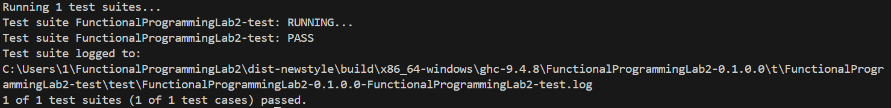

Лабораторная работа №2
======

Анисимов Максим Дмитриевич Р3333
Структура данных: AVL Tree
Интерфейс: Multiset

Требования
---

1. Функции:

    * добавление и удаление элементов;
    * фильтрация;
    * отображение (map);
    * свертки (левая и правая);
    * структура должна быть моноидом.

2. Структуры данных должны быть неизменяемыми.
3. Библиотека должна быть протестирована в рамках unit testing.
4. Библиотека должна быть протестирована в рамках
property-based тестирования (как минимум 3 свойства, включая свойства моноида).
5. Структура должна быть полиморфной.
6. Требуется использовать идиоматичный для технологии стиль программирования

Основная реализация
---

```haskell
{-# LANGUAGE ScopedTypeVariables #-}

module AVLTree where

import           Test.QuickCheck

data AVLTree a = Empty
               | Node (AVLTree a) a Int (AVLTree a) Int
               deriving (Show, Eq)

instance (Arbitrary a) => Arbitrary (AVLTree a)
instance Semigroup (AVLTree a) where
    Empty <> tree          = tree
    tree <> Empty          = tree
    Node l x h r _ <> tree = Node l x h (r <> tree) undefined

instance Monoid (AVLTree a) where
    mempty = Empty
    mappend = (<>)

height :: AVLTree a -> Int
height Empty            = 0
height (Node _ _ _ _ h) = h

balanceFactor :: AVLTree a -> Int
balanceFactor Empty                   = 0
balanceFactor (Node left _ _ right _) = height left - height right

mkNode :: AVLTree a -> a -> Int -> AVLTree a -> AVLTree a
mkNode left value count right =
     Node left value count right (1 + max (height left) (height right))

rotateRight :: AVLTree a -> AVLTree a
rotateRight (Node (Node left value count right _) v c rightTree _) =
    mkNode left value count (mkNode rightTree v 1 rightTree)

rotateLeft :: AVLTree a -> AVLTree a
rotateLeft (Node left value count (Node leftTree v countR rightTree _) _) =
    mkNode (mkNode left value count leftTree) v countR rightTree

balance :: AVLTree a -> AVLTree a
balance tree
    | balanceFactor tree > 1 = if balanceFactor (left tree) < 0
                                then rotateRight (rotateLeft tree)
                                else rotateRight tree
    | balanceFactor tree < -1 = if balanceFactor (right tree) > 0
                                 then rotateLeft (rotateRight tree)
                                 else rotateLeft tree
    | otherwise = tree
  where
    left (Node l _ _ _ _) = l
    right (Node _ _ _ r _) = r

insert :: (Ord a) => a -> AVLTree a -> AVLTree a
insert value Empty = mkNode Empty value 1 Empty
insert value (Node left v count right _)
    | value < v = balance $ mkNode (insert value left) v count right
    | value > v = balance $ mkNode left v count (insert value right)
    | otherwise = balance $ mkNode left v (count + 1) right

delete :: (Ord a) => a -> AVLTree a -> AVLTree a
delete _ Empty = Empty
delete value (Node left v count right _)
    | value < v = balance $ mkNode (delete value left) v count right
    | value > v = balance $ mkNode left v count (delete value right)
    | otherwise = case count of
        1 -> case (left, right) of
            (Empty, _) -> right
            (_, Empty) -> left
            _ -> balance $ mkNode left minValue 1 (delete minValue right)
                where minValue = findMin right
        n -> balance $ mkNode left v (n - 1) right

findMin :: AVLTree a -> a
findMin (Node Empty value _ _ _) = value
findMin (Node left _ _ _ _)      = findMin left

contains :: (Ord a) => a -> AVLTree a -> Bool
contains _ Empty = False
contains value (Node left v count right _)
    | value < v = contains value left
    | value > v = contains value right
    | otherwise = True

uniqueItems :: AVLTree a -> [a]
uniqueItems Empty = []
uniqueItems (Node left value count right _) = 
    uniqueItems left ++ replicate count value ++ uniqueItems right

toList :: AVLTree a -> [a]
toList Empty = []
toList (Node left value count right _) =
     concat (replicate count [value]) ++ toList left ++ toList right

filterTree :: (Ord a) => (a -> Bool) -> AVLTree a -> AVLTree a
filterTree _ Empty = Empty
filterTree predicate (Node left value count right _)
    | predicate value = 
        mkNode (filterTree predicate left) value count (filterTree predicate right)
    | otherwise = merge (filterTree predicate left) (filterTree predicate right)

merge :: (Ord a) => AVLTree a -> AVLTree a -> AVLTree a
merge Empty tree                                   = tree
merge tree Empty                                   = tree
merge left@(Node {}) right@(Node {}) = balance (append left right)

append :: (Ord a) => AVLTree a -> AVLTree a -> AVLTree a
append Empty tree = tree
append tree Empty = tree
append left right = balance (mkNode left minValue 1 (delete minValue right))
    where minValue = findMin right

mapTree :: (a -> b) -> AVLTree a -> AVLTree b
mapTree _ Empty = Empty
mapTree f (Node left value count right _) =
     mkNode (mapTree f left) (f value) count (mapTree f right)

foldlAVL :: (b -> a -> b) -> b -> AVLTree a -> b
foldlAVL _ acc Empty = acc
foldlAVL f acc (Node left value count right _) =
    foldlAVL f (foldlAVL f (applyCount f acc count value) left) right
  where
    applyCount _ acc 0 _ = acc
    applyCount g acc n v = applyCount g (g acc v) (n - 1) v

foldrAVL :: (a -> b -> b) -> b -> AVLTree a -> b
foldrAVL _ acc Empty = acc
foldrAVL f acc (Node left value count right _) =
    foldrAVL f (f value (foldrAVL f acc right)) left
```

Тестирование
---

Данная структура данных протестирована с помощью unit тестов и property-based тестов.

